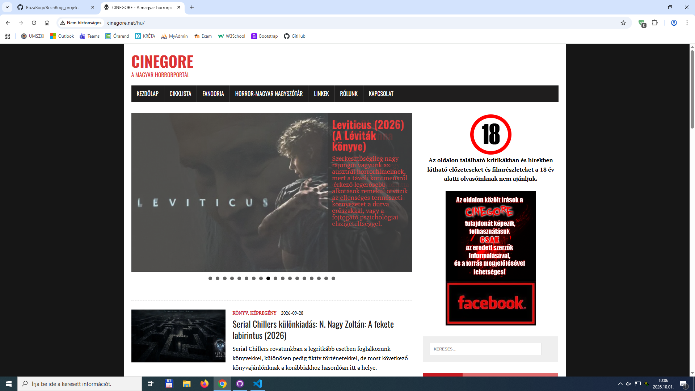
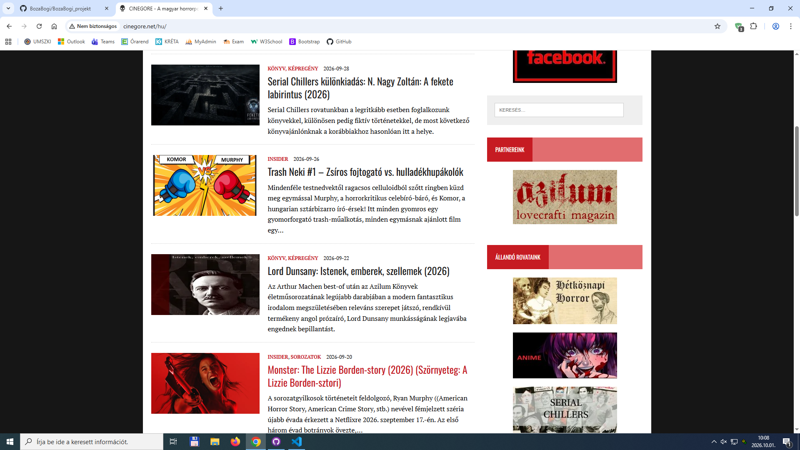
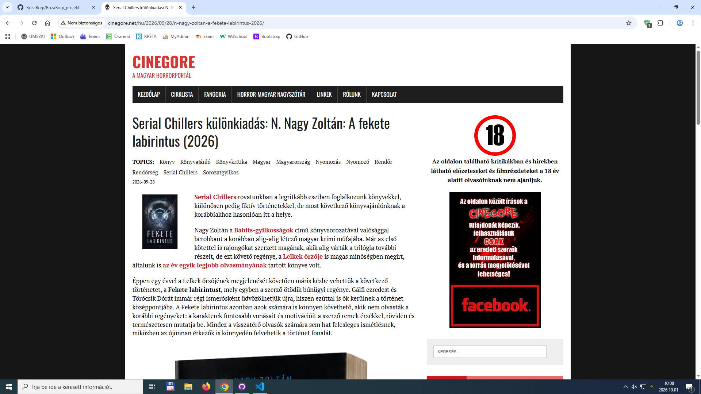

# Horror filmek az évszázadokból
## Véleményezés
### https://www.mafab.hu/filmek/filmek/1/?yrf=&yrt=&genre=27 = példa oldal
### https://www.filmbooster.hu/mufajok/5-horror/ = példa oldal

### Szöveg és ötletek az oldalhoz:

        Idézetek filemkből/íróktól

        "Milyen nagyszerű nap az ördögűzésre” – Az Ördögűző

        „Én vagyok most a barátod, Nancy” – Freddy Krueger, Rémálom az Elm utcában

        „Bizonyos dolgokat jobb nem látni és nem hallani, csak amikor már vége…” – Stephen King: Az

        „Emberiségünk legősibb és legerősebb érzése a félelem, a legősibb és legerősebb félelem pedig az ismeretlentől való félelem.” The Writer H.P Lovecraft

- legrégibb horror film ismertető: Az ördög kastélya (Le Manoir du Diable)

## Tartalom

- Blogszerű oldal.
- A filmnézők különböző horror filmekről tudnak információt szerezni. 
- A horror filmek közül is több műfajt találhatnak meg, például: természetfeletti, gore. Ezekről egy rövid leírás található: Miről szól? Kik a színészek? Kik csinálták? 
- A filmről való információk mellett az íróról is olvashatnak egy-két érdekességet, további híres filmjei, miért pont egy ilyen filmet írt?

## Ötlet az oldal kinézetéhez

### http://www.cinegore.net/hu/ 

- A navigációs sávban a logó máshogy, esetleg egy nagyobb kép az egészen végig.
- Kevesebb link a navigációs sávban.
- A carousel lehet nagyobb és ne legyen két sáv.

## Body

- kevesebb film
- átláthatóbb, interaktívabb, de nem túl sok

## Filmekről részletesebb

- Kevesebb szöveg, de ugyanúgy elég információ
- Íróról/rendezőkről pici információ